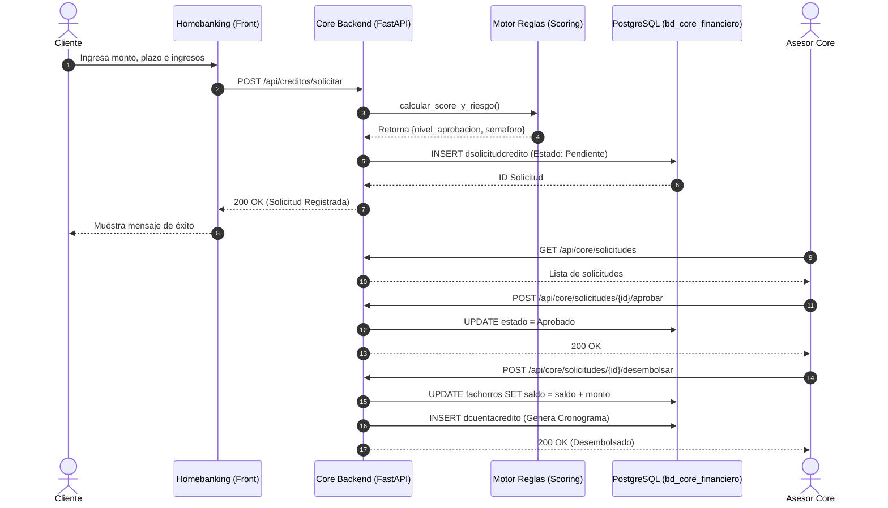
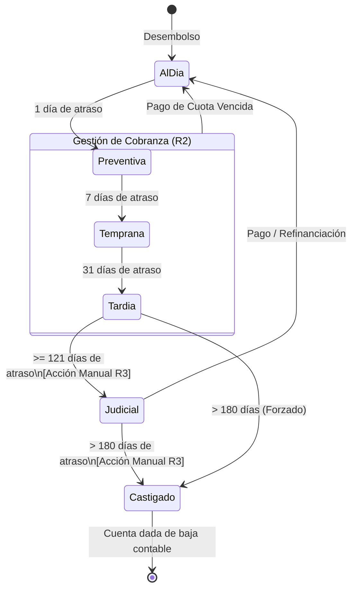

# Documentación Oficial del Proyecto: Core Financiero BBVA Perú

El presente documento recopila las **Historias de Usuario (HU)**, **Requerimientos Funcionales (RF)** y los **Diagramas UML** que soportan la arquitectura del proyecto académico "Core Financiero BBVA", cumpliendo cabalmente con los criterios del Módulo de Recuperaciones y la rúbrica de evaluación.

---

## 1. Requerimientos Funcionales (RF)

| Código | Requerimiento Funcional | Módulo Asociado |
| :--- | :--- | :--- |
| **RF-01** | El sistema debe permitir al usuario cliente simular un préstamo personal especificando monto y plazo, y mostrando la TEA referencial (18.5%). | Homebanking |
| **RF-02** | El sistema debe permitir enviar la solicitud de crédito desde el Homebanking hacia el Core Bancario. | Homebanking / Core |
| **RF-03** | El sistema debe evaluar automáticamente (Scoring) el nivel de riesgo de la solicitud mediante un motor de reglas (RDS) asignando semáforos verde, amarillo o rojo. | Core (Otorgamiento) |
| **RF-04** | El sistema debe requerir que los créditos con nivel de aprobación "N3 - Comité" sean aprobados por un Gerente de Agencia o usuario de mayor jerarquía. | Core (Otorgamiento) |
| **RF-05** | El sistema debe depositar el monto aprobado en la cuenta de ahorros del cliente al ejecutar el "Desembolso" y generar un cronograma oficial. | Core (Otorgamiento) |
| **RF-06** | El sistema debe listar la cartera de créditos en mora, clasificándola por bandas (Preventiva, Temprana, Tardía, Judicial, Castigo) según los días de atraso. | Core (Recuperaciones) |
| **RF-07** | El sistema debe permitir a un Asesor o Gestor de Cobranzas registrar el detalle de las gestiones (llamadas, visitas) indicando compromisos de pago. | Core (Recuperaciones) |
| **RF-08** | El sistema debe permitir derivar un crédito a "Cobranza Judicial" si los días de atraso son mayores o iguales a 121 días. | Core (Recuperaciones) |
| **RF-09** | El sistema debe permitir realizar el "Castigo Contable" (dar de baja el crédito) si los días de atraso son mayores a 180 días. | Core (Recuperaciones) |
| **RF-10** | El sistema debe restringir las acciones de aprobación, desembolso y castigo contable mediante control de accesos basado en roles (RBAC). | Seguridad |

---

## 2. Historias de Usuario Principales (HU)

### HU-01: Simulación y Solicitud (Cliente)
> **Como** cliente del Banco BBVA,<br>
> **Quiero** simular un crédito personal de libre disponibilidad desde mi Homebanking,<br>
> **Para** conocer la cuota mensual exacta antes de enviar mi solicitud oficial a evaluación.
> * **Criterio de Aceptación:** El simulador debe aplicar la TEA de 18.5% y calcular correctamente las cuotas en base al sistema francés. Al aceptar, el estado de la solicitud debe ser "pendiente".

### HU-02: Evaluación y Aprobación (Analista de Riesgos)
> **Como** Analista de Riesgos del BBVA,<br>
> **Quiero** ver la bandeja de solicitudes y abrir el Reporte de Detalle de Solicitud (RDS),<br>
> **Para** visualizar el nivel de riesgo (semáforo) de un cliente y aprobar o rechazar su solicitud.
> * **Criterio de Aceptación:** Si el cliente tiene deudas previas altas, el semáforo será rojo o amarillo. Solo si tengo el rol adecuado, podré presionar "Aprobar".

### HU-03: Gestión de Mora (Gestor de Cobranzas)
> **Como** Gestor de Cobranzas,<br>
> **Quiero** visualizar la cartera en mora filtrada por bandas (ej. Mora Temprana),<br>
> **Para** priorizar mis llamadas y registrar el compromiso de pago del cliente en el historial.
> * **Criterio de Aceptación:** Al hacer clic en "Gestionar", se debe abrir un modal que permita guardar el tipo de gestión, resultado y fecha de promesa de pago.

### HU-04: Transición a Judicial y Castigo (Administrador / Gerente)
> **Como** Gerente de Sucursal,<br>
> **Quiero** poder derivar créditos incobrables a Cobranza Judicial o ejecutar el Castigo Contable,<br>
> **Para** sanear la cartera de la agencia según la normativa de la SBS.
> * **Criterio de Aceptación:** El botón "Judicial" solo se habilitará si el atraso es $\ge$ 121 días. El botón "Castigar" solo se habilitará si el atraso es > 180 días.

---

## 3. Diagramas UML

### 3.1. Diagrama de Casos de Uso (Flujo Principal)
Representa la interacción de los actores con los sistemas Homebanking y Core Bancario.

```mermaid
usecaseDiagram
  actor Cliente as "Cliente"
  actor Asesor as "Asesor / Analista"
  actor Gerente as "Gerente / Admin"

  package "BBVA Homebanking" {
    usecase UC1 as "Simular Crédito"
    usecase UC2 as "Solicitar Crédito"
    usecase UC3 as "Consultar Saldo (Ahorros)"
  }

  package "Core Bancario BBVA" {
    usecase UC4 as "Evaluar Scoring (RDS)"
    usecase UC5 as "Aprobar Solicitud"
    usecase UC6 as "Desembolsar Crédito"
    usecase UC7 as "Registrar Gestión de Mora"
    usecase UC8 as "Derivar a Judicial"
    usecase UC9 as "Castigar Crédito"
  }

  Cliente --> UC1
  Cliente --> UC2
  Cliente --> UC3

  Asesor --> UC4
  Asesor --> UC5
  Asesor --> UC7

  Gerente --> UC5
  Gerente --> UC6
  Gerente --> UC8
  Gerente --> UC9

  UC2 ..> UC4 : <<include>>
  UC5 ..> UC6 : <<precedes>>
```

*(Nota: En herramientas que no soporten `usecaseDiagram` nativo, esta estructura representa claramente el modelo estándar UML)*

---

### 3.2. Diagrama de Secuencia: Solicitud y Desembolso
Describe el flujo desde que el cliente solicita el crédito hasta que el dinero entra en su cuenta.



---

### 3.3. Diagrama de Estados: Módulo de Recuperaciones (Mora)
Describe cómo un crédito transita por el proceso de cobranzas con el paso de los días.



---
**Fin del Documento.**  
*Este archivo puede ser exportado a PDF mediante Visual Studio Code (extensión Markdown PDF) o en cualquier visor web.*
