# Diagramas UML — Core Bancario y Homebanking BBVA Perú Simulado

Esta carpeta contiene los diagramas UML del proyecto académico **Sistema Integrado BBVA Perú Simulado**. Los diagramas documentan la arquitectura, actores, flujos, seguridad, modelo de datos y procesos principales del sistema.

El proyecto está compuesto por dos aplicaciones principales:

* **Homebanking BBVA**, utilizado por los clientes.
* **Core Bancario BBVA**, utilizado por el personal interno del banco.

Ambas aplicaciones comparten la base de datos PostgreSQL local:

```txt
bd_core_financiero
```

La integración principal del sistema se basa en el siguiente flujo:

```txt
Cliente solicita crédito en Homebanking
        ↓
La solicitud se registra en solicitudes_prestamo
        ↓
El Core Bancario visualiza y evalúa la solicitud
        ↓
El Core aprueba, rechaza o desembolsa
        ↓
El desembolso actualiza cuentas y transacciones
        ↓
El cliente visualiza saldo y movimientos en Homebanking
```

---

## Herramienta utilizada

Los diagramas se editan y previsualizan con la extensión **PlantUML** de VS Code o Antigravity IDE.

Extensión recomendada:

```txt
PlantUML
Autor: jebbs
ID: jebbs.plantuml
```

---

## Archivos UML

| Archivo                                     | Diagrama                        | Descripción                                                                                                                                                       |
| ------------------------------------------- | ------------------------------- | ----------------------------------------------------------------------------------------------------------------------------------------------------------------- |
| `01_componentes_bbva.puml`                  | Diagrama de componentes         | Muestra la arquitectura general: Homebanking, Core Bancario, Backends FastAPI, Frontends React y PostgreSQL.                                                      |
| `02_casos_uso_bbva.puml`                    | Diagrama de casos de uso        | Representa las funcionalidades del cliente, asesor, administrador, jefe regional, riesgos y gestor de cobranza.                                                   |
| `03_secuencia_credito_desembolso_bbva.puml` | Diagrama de secuencia           | Describe el flujo completo de solicitud, aprobación, desembolso y actualización de saldo.                                                                         |
| `04_clases_bbva.puml`                       | Diagrama de clases              | Presenta las entidades principales del dominio: usuario, cuenta, transacción, solicitud, personal y cobranza.                                                     |
| `05_modelo_datos_bbva.puml`                 | Modelo de datos resumen         | Representa las tablas principales utilizadas en la integración: `app_usuarios`, `cuentas`, `transacciones`, `solicitudes_prestamo`, `pagos` y tablas de personal. |
| `06_estados_mora_bbva.puml`                 | Diagrama de estados             | Describe la transición de un crédito desde al día hasta mora preventiva, temprana, tardía, judicial y castigo.                                                    |
| `07_roles_permisos_bbva.puml`               | Roles y permisos                | Muestra qué acciones puede realizar cada rol del sistema.                                                                                                         |
| `08_despliegue_local_bbva.puml`             | Diagrama de despliegue local    | Explica cómo se ejecutan los frontends, backends y PostgreSQL en el entorno local.                                                                                |
| `09_secuencia_seguridad_rbac_jwt.puml`      | Secuencia de seguridad RBAC/JWT | Explica el login del Core, generación de token, validación de rol y autorización de acciones críticas.                                                            |

---

## Previsualizar en VS Code o Antigravity

Para visualizar los diagramas:

1. Instala la extensión **PlantUML** (`jebbs.plantuml`).
2. Abre cualquier archivo `.puml`.
3. Presiona:

```txt
Alt + D
```

También puedes abrirlo desde la paleta de comandos:

```txt
Ctrl + Shift + P
```

Luego busca:

```txt
PlantUML: Preview Current Diagram
```

Si el archivo tiene varios diagramas, coloca el cursor dentro del bloque correspondiente:

```plantuml
@startuml
...
@enduml
```



y luego abre la vista previa.

---

## Exportar diagramas desde VS Code o Antigravity

Para exportar un diagrama:

1. Abre el archivo `.puml`.
2. Haz clic derecho dentro del archivo.
3. Selecciona:

```txt
PlantUML: Export Current Diagram
```

4. Selecciona el formato deseado:

```txt
PNG
SVG
PDF
```

Se recomienda exportar en **PNG** para insertar las imágenes en Word o PDF.

---

## Exportar por terminal

Si tienes `plantuml.jar`, también puedes exportar los diagramas desde la terminal:

```bash
java -jar plantuml.jar docs/04_arquitectura_uml/*.puml
```

Para generar SVG:

```bash
java -jar plantuml.jar -tsvg docs/04_arquitectura_uml/*.puml
```

Para generar PDF:

```bash
java -jar plantuml.jar -tpdf docs/04_arquitectura_uml/*.puml
```

---

## Requisitos técnicos

Para usar PlantUML localmente se recomienda tener instalado:

* Java JDK.
* Graphviz.
* Extensión PlantUML en VS Code o Antigravity.

Si no deseas instalar Graphviz, puedes configurar la extensión PlantUML para usar un servidor de renderizado remoto.

---

## Carpeta de exportados

Se recomienda guardar las imágenes exportadas en una carpeta separada:

```txt
docs/04_arquitectura_uml/exportados/
```

Estructura sugerida:

```txt
docs/04_arquitectura_uml/
│
├── 01_componentes_bbva.puml
├── 02_casos_uso_bbva.puml
├── 03_secuencia_credito_desembolso_bbva.puml
├── 04_clases_bbva.puml
├── 05_modelo_datos_bbva.puml
├── 06_estados_mora_bbva.puml
├── 07_roles_permisos_bbva.puml
├── 08_despliegue_local_bbva.puml
├── 09_secuencia_seguridad_rbac_jwt.puml
├── README.md
│
└── exportados/
    ├── 01_componentes_bbva.png
    ├── 02_casos_uso_bbva.png
    ├── 03_secuencia_credito_desembolso_bbva.png
    ├── 04_clases_bbva.png
    ├── 05_modelo_datos_bbva.png
    ├── 06_estados_mora_bbva.png
    ├── 07_roles_permisos_bbva.png
    ├── 08_despliegue_local_bbva.png
    └── 09_secuencia_seguridad_rbac_jwt.png
```

---

## Relación con la rúbrica

Estos diagramas sirven como evidencia para los criterios de:

* Integración entre Core Bancario y Homebanking.
* Arquitectura en capas.
* Documentación técnica.
* Seguridad por roles.
* Flujo de crédito y desembolso.
* Recuperaciones y mora.
* Modelo de datos y trazabilidad.

---

## Nota académica

Los diagramas representan una simulación académica de un sistema bancario inspirado en BBVA Perú. No representan arquitectura interna oficial ni políticas reales del banco.
