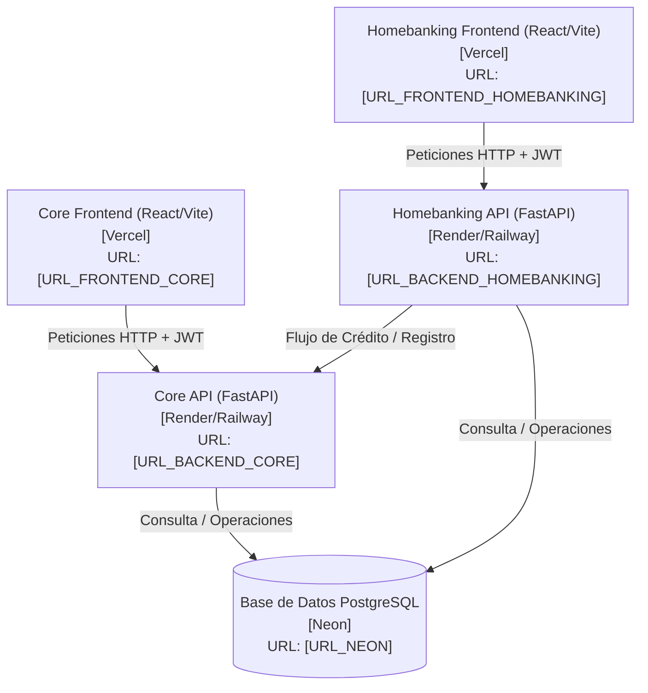

# Plan de Despliegue en la Nube — BBVA Perú Simulado

Este documento detalla la arquitectura de despliegue en producción y la topología de red para el sistema **BBVA Perú Simulado**. 

## 1. Arquitectura de Despliegue

El sistema está compuesto por cuatro componentes principales (dos frontends y dos backends) conectados a una única base de datos PostgreSQL en la nube (Neon).

## 2. Componentes y Plataformas Seleccionadas

| Módulo | Tipo | Plataforma de Despliegue | URL de Producción (Marcador) |
|---|---|---|---|
| **Base de Datos** | PostgreSQL 18 | **Neon** | `[URL_NEON]` |
| **bbva-backend** | API REST (FastAPI) | **Render o Railway** | `[URL_BACKEND_HOMEBANKING]` |
| **core-backend** | API REST (FastAPI) | **Render o Railway** | `[URL_BACKEND_CORE]` |
| **bbva-fronted** | Frontend SPA (React + Vite) | **Vercel** | `[URL_FRONTEND_HOMEBANKING]` |
| **core-fronted** | Frontend SPA (React + Vite) | **Vercel** | `[URL_FRONTEND_CORE]` |

---

## 3. Orden Recomendado de Despliegue

Para asegurar una integración sin fallas, se debe seguir estrictamente este orden de despliegue:

1. **Paso 1: Base de Datos en Neon**
   - Crear el proyecto en Neon y obtener la cadena de conexión `[URL_NEON]`.
   - Restaurar el backup `backup_bbva_sin_owner.sql` para tener la estructura y datos de semilla de inmediato.
2. **Paso 2: Backend Core (core-backend)**
   - Desplegar el API Core en Render/Railway con la variable de base de datos apuntando a Neon.
   - Guardar la URL pública obtenida `[URL_BACKEND_CORE]`.
3. **Paso 3: Backend Homebanking (bbva-backend)**
   - Desplegar el API Homebanking en Render/Railway.
   - Configurar la variable de conexión a Neon y las URLs del core bancario.
   - Guardar la URL pública obtenida `[URL_BACKEND_HOMEBANKING]`.
4. **Paso 4: Frontend Core (core-fronted)**
   - Desplegar en Vercel apuntando a `[URL_BACKEND_CORE]` mediante variables de entorno.
   - Guardar la URL pública de producción `[URL_FRONTEND_CORE]`.
5. **Paso 5: Frontend Homebanking (bbva-fronted)**
   - Desplegar en Vercel apuntando a `[URL_BACKEND_HOMEBANKING]`.
   - Guardar la URL pública de producción `[URL_FRONTEND_HOMEBANKING]`.
6. **Paso 6: Actualización de CORS en los Backends**
   - Regresar a la configuración de Render/Railway de ambos backends y actualizar la variable `CORS_ALLOWED_ORIGINS` con las URLs reales de Vercel obtenidas en los pasos 4 y 5. Esto cerrará la brecha de seguridad de CORS y habilitará solo los dominios autorizados.
