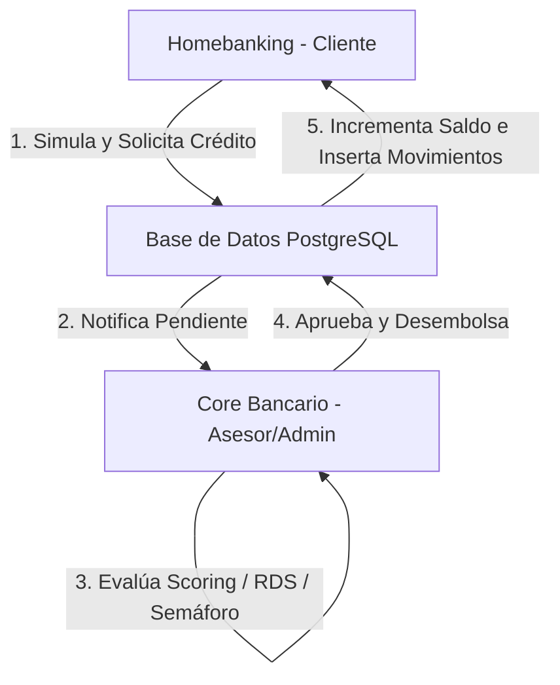

# 👔 Resumen Ejecutivo del Proyecto — BBVA Perú Simulado

Este documento presenta una perspectiva estratégica y técnica de alto nivel sobre el sistema integrado **BBVA Perú Simulado**, diseñado como un entregable académico profesional.

---

## 🎯 1. El Problema que Resuelve
En la formación de ingeniería de software, los proyectos suelen desarrollarse como silos aislados: un backend simple o una interfaz de usuario sin lógica de negocio conectada a regulaciones reales. 

**BBVA Perú Simulado** resuelve este problema integrando dos canales transaccionales reales bajo una única base de datos centralizada de alta seguridad:
* **El Canal del Cliente (Homebanking):** Permite al cliente simular, solicitar préstamos y gestionar sus cuentas.
* **El Canal del Banco (Core Bancario):** Permite al personal de agencia (asesores, administradores, riesgos) evaluar la viabilidad de riesgo del cliente, determinar la elegibilidad y ejecutar el desembolso formal.

Esta arquitectura simula de extremo a extremo la cadena de valor financiera de un banco comercial peruano real.

---

## 🏛️ 2. Módulos y Flujo del Sistema
El sistema consta de los siguientes componentes acoplados:

* **Módulo de Originación (Homebanking):** Simulación matemática de cuotas fijas (sistema francés) a una tasa fija y envío formal de solicitudes.
* **Módulo de Evaluación de Riesgos (Core):** Scoring automatizado basado en ingresos declarados y semaforización según el Ratio de Sobreendeudamiento (RDS) del cliente.
* **Módulo de Decisión Multinivel:** Flujo de aprobación ruteado según el monto solicitado:
  * Hasta S/ 10,000 ➔ Asesor de Negocios.
  * S/ 10,001 a S/ 50,000 ➔ Administrador de Agencia.
  * S/ 50,001 a S/ 200,000 ➔ Jefe Regional.
  * Más de S/ 200,000 ➔ Comité de Riesgos.
* **Módulo de Captaciones e Historial (Ahorros y Pagos):** Registro de transacciones inmediatas entre cuentas locales y pagos de servicios.
* **Módulo de Cobranzas y Recuperaciones (Mora):** Clasificación en bandas de atraso (Preventiva, Temprana, Tardía, Judicial, Castigo) y registro de compromisos de pago.

---

## 📈 3. Valor Aportado

### A. Valor Financiero (Negocio)
* **Regulación y Control:** Automatización de políticas del Banco Central de Reserva del Perú (BCRP) y la Superintendencia de Banca, Seguros y AFP (SBS) mediante el cálculo automático de provisiones y restricciones de endeudamiento (RDS).
* **Eficiencia Operativa:** Reducción del tiempo de evaluación y desembolso a través de la integración en línea entre el canal del cliente y el core financiero.

### B. Valor Informático (Tecnológico)
* **Arquitectura Orientada a Servicios:** Backends distribuidos e independientes que comparten una capa de datos robusta.
* **Ciberseguridad Defensiva Activa:** Mitigación en el código de vulnerabilidades OWASP:
  * Tokens firmados **JWT** para evitar suplantaciones.
  * Encriptación irreversible **Bcrypt** de contraseñas.
  * Control de acceso estricto a nivel de base de datos para evitar **IDOR** (Insecure Direct Object References).
  * Parámetros aislados en SQL para prevenir **SQL Injection**.

---

## 🛠️ 4. Tecnologías Utilizadas
* **Backend APIs:** Python 3.10+, FastAPI, Uvicorn, SQLAlchemy, Psycopg2.
* **Frontend Webapps:** React.js, Vite, Axios, Tailwind CSS, Lucide Icons.
* **Base de Datos:** PostgreSQL (Estructuras transaccionales `app_usuarios` y de negocio `dcliente`, `dcuenta`, `dsolicitud`).
* **Análisis de Datos:** Power BI Desktop conectado por ODBC/DirectQuery a vistas de base de datos (`vw_bbva_*`).

---

## ⚠️ 5. Alcance Académico y Aclaración Legal
Este proyecto es una **simulación con fines académicos y experimentales** desarrollada para la asignatura de Ingeniería de Software. La marca "BBVA", los logos y las tasas utilizadas se han tomado como referencia con fines demostrativos basándose en información pública y proformas del mercado de BBVA Perú. No representa ninguna política de negocio interna oficial del banco BBVA, ni tiene vinculación con sistemas transaccionales con dinero real.
